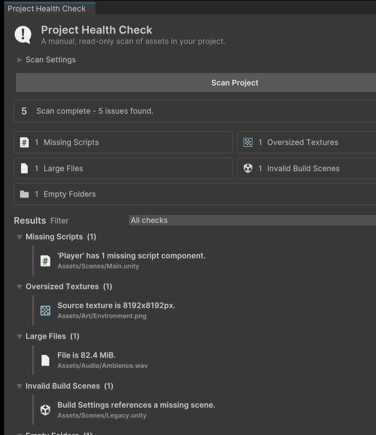

# Project Health Check for Unity

[](https://github.com/ludioo/Unity-Project-Health-Check/actions/workflows/editmode-tests.yml)
[](https://unity.com/releases/editor/whats-new/2022.3.23)
[](LICENSE)

A lightweight, read-only Unity Editor tool for finding common project health issues before they
turn into build failures, repository bloat, or difficult cleanup work.



## Background

Unity projects accumulate broken references and oversized assets quietly. These problems are easy
to miss during daily development and expensive to discover late in production. Project Health
Check provides one manual scan with clear, actionable paths while leaving project content untouched.

## Goals

- Keep scanning fast, explicit, and read-only.
- Work as an Editor-only UPM package with no third-party dependencies.
- Report useful project paths without automatically changing assets.
- Stay compatible with Unity 2022.3 LTS.

## Checks

| Check | Reports |
| --- | --- |
| Missing Scripts | Missing MonoBehaviour components in prefabs and scenes |
| Oversized Textures | Source width or height above the configured pixel threshold |
| Large Files | Assets at or above the configured MiB threshold |
| Invalid Build Scenes | Empty or missing scene entries in Build Settings |
| Empty Folders | Leaf folders containing no assets or subfolders |

## Requirements

- Unity 2022.3 LTS or newer
- No third-party runtime dependencies

## Installation

In Unity, open **Window > Package Manager**, choose **Add package from git URL**, and enter:

```text
https://github.com/ludioo/Unity-Project-Health-Check.git?path=/Packages/com.ludioo.project-health-check#v0.1.2
```

## Development

Open the repository root as a Unity project. Production package files live in
`Packages/com.ludioo.project-health-check`; project-only fixtures live in `Assets/Development`.

See [CONTRIBUTING.md](CONTRIBUTING.md) before contributing.

## Usage

Open **Tools > Project Health Check**, adjust the texture or file-size thresholds if needed,
then select **Scan Project**. Results cover the `Assets` folder only. Use **Select / Ping** to
locate an affected asset. Version 0.1 reports issues but never modifies assets.

Results are grouped by check and can be filtered without running another scan. Threshold changes
last for the current window only.

## Safety and limitations

- Scans `Assets/` only; package dependencies and generated folders are excluded.
- Does not modify scenes, prefabs, import settings, or Build Settings.
- Scans run manually—there is no background or pre-build hook.
- Automatic fixes, suppressions, persistent settings, and JSON reports are not available yet.

## Testing

The package includes EditMode coverage for all five checks, scene/Build Settings restoration, UI
assets, default settings, summary counts, filtering, empty states, and safe Ping behavior.
GitHub Actions runs the EditMode suite on pushes and pull requests targeting `main` and `develop`,
and retains test artifacts and logs for debugging failed runs.

See the current and planned work in [ROADMAP.md](ROADMAP.md).
